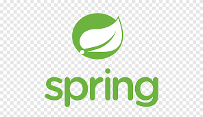
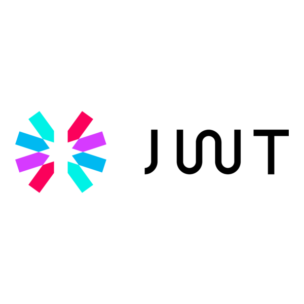

<h1 align="center">Hi 👋, I'm Andy</h1>
<h3 align="center">A Backend Developer from Viet Nam </h3>

  

- ✍ I'm a college student at: [Can Tho University](https://www.ctu.edu.vn/) (CTU).

- 🌱 I’m currently learning **Spring Framework**.

- 👨‍💻 Passionate about building scalable backend services, recommendation systems.

- 🚀 Enjoy exploring new technologies and solving challenging problems.

## 📫 Connect with me:

  
  &nbsp;&nbsp;
  
  &nbsp;&nbsp;
  

## 🚀 Skills:

  
  
  
  
  
  
  
  
  
  
  
  

## 🔥 Featured Projects

### [E-commerce Website](#)
- A fully functional **E-commerce platform** with integrated recommendation system.  
- Implemented **User-based Collaborative Filtering (UBCF)** and **Content-based Filtering (CBF)** for personalized product suggestions.  
- Used **SigLIP2** for **image and text feature extraction** to enhance recommendation accuracy.  
- Enabled **visual product search** by leveraging **SigLIP2 image feature extraction**.  
- Integrated **semantic search** using **LLM Gemini** to enhance product discovery.  
- Integrated **real-time chat** using **WebSocket** for seamless customer communication.  
- Integrated **GHN API** for efficient shipping and order tracking.  

**🛠 Technologies:**  
`Java`, `Spring Boot`, `React`, `Python`, `SigLIP2`, `LLM Gemini`, `WebSocket`, `GHN API`

## 🎓 Certifications & Achievements
- 🏆 Completed [**Spring Boot Course**](https://www.udemy.com/course/spring-springboot-jpa-hibernate-zero-to-master/) from Udemy.

## 📈 GitHub Activity Graph:

## 📈 Top Languages & GitHub Stats:

  
  

